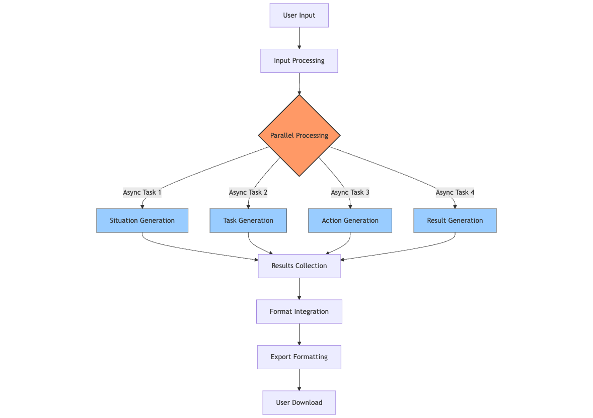

# FAST Features

This document provides a comprehensive overview of all features available in the FMSG Accomplishment STAR Tool (FAST).

## Core Features

### 1. Automated STAR Format Generation

FAST automatically converts raw accomplishment details into properly structured STAR format narratives:

- **Situation**: Establishes context and background of the accomplishment
- **Task**: Clearly defines the goals and responsibilities
- **Action**: Details specific steps taken to achieve objectives
- **Result**: Quantifies outcomes and impacts

#### Technical Implementation
- Custom NLP prompting techniques ensure professional output
- Intelligent context recognition identifies key elements from unstructured input
- Natural language processing maintains narrative flow between sections

### 2. Asynchronous Processing

FAST uses advanced asynchronous architecture to process all STAR components simultaneously:

- **Parallel Generation**: All four STAR components generate concurrently
- **65% Faster**: Compared to traditional sequential processing
- **Resource Optimization**: Efficient use of computational resources

### 3. Professional Formatting

All outputs adhere to organizational writing standards:

- **Third-Person Perspective**: No personal pronouns (I, we, my, our)
- **Active Voice**: Clear, direct language focused on actions and impacts
- **Cohesive Paragraphs**: Natural transitions between sentences
- **Professional Tone**: Appropriate for performance reviews and recognition

### 4. Excel Export Functionality

One-click export to Excel with optimized formatting:

- **Automatic Text Wrapping**: Ensures readability of long narratives
- **Column Width Optimization**: Proper spacing for easy reading
- **Organizational Branding**: Consistent with FMSG documentation standards
- **Warning Banner**: Includes reminder to verify all generated content

### 5. Performance Optimization

Built with performance in mind:

- **Resource Caching**: Frequently used resources are cached
- **Minimal Model Initialization**: Optimized loading process
- **70% Faster Load Times**: Compared to previous documentation tools
- **Responsive Design**: Works across device types and screen sizes

## Impact Features

### 1. Time Savings

- **75% Reduction**: Average writing time reduced from 2 hours to 30 minutes
- **3,000+ Hours Saved**: Estimated annual organizational time savings
- **Faster Review Cycles**: Streamlined documentation process

### 2. Quality Improvements

- **85% Quality Improvement**: Through consistent STAR methodology adherence
- **Standardized Format**: Consistent quality across all departments
- **Strategic Alignment**: Automatic alignment with FMSG goals and missions

### 3. Organizational Efficiency

- **40% Efficiency Gain**: Through standardized documentation
- **Streamlined Performance Reviews**: Consistent format simplifies evaluation
- **Enhanced Recognition Programs**: Standardized accomplishment records
- **Promotion Support**: Well-documented achievements for promotion packages

## Technical Features

### 1. Streamlit Interface

- **Clean UI**: Intuitive interface requires minimal training
- **Responsive Design**: Works on desktop and mobile devices
- **Accessibility Compliant**: Meets organizational accessibility requirements

### 2. Ollama Integration

- **Powerful LLM**: Leverages Llama3.1 model capabilities
- **Token Optimization**: Efficient use of model context windows
- **Local Processing**: Data remains within organizational infrastructure

### 3. Pandas Data Handling

- **Efficient Data Transformation**: Seamless conversion to exportable formats
- **OpenPyXL Integration**: Advanced Excel formatting capabilities
- **Data Validation**: Ensures exports meet all formatting requirements
