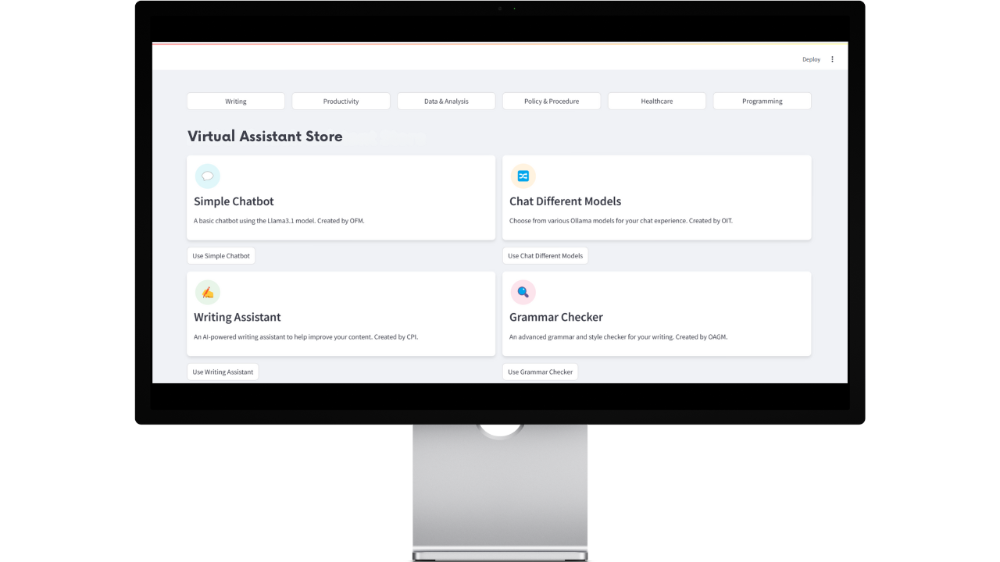

IMPORTANT NOTICE: This repository contains only mockups, documentation, and demonstration assets for the Virtual Assistant Store application. The actual source code is not publicly available. This repository is intended for showcase and demonstration purposes only.

# Virtual Assistant Store

## Overview

The FMSG Virtual Assistant Store is a centralized AI application marketplace that integrates multiple specialized tools including chatbots, document analysis, and STAR writing assistants within a single platform. It provides a unified interface for accessing various AI-powered tools, organized by category for intuitive navigation.

## 🌟 Key Features

- **Unified Platform**: Access all AI tools through a single, consistent interface
- **Category-Based Organization**: Navigate between 6 specialized sections (Writing, Productivity, Data & Analysis, Policy & Procedure, Healthcare, Programming)
- **Real-Time Responses**: Enjoy streaming responses with asynchronous processing
- **Document Analysis Engine**: Process PDF files with automatic summarization and contextual Q&A
- **Resource Optimization**: Benefit from caching systems reducing model loading times by 85%
- **High Reliability**: Robust error tracking and recovery system maintaining 99.8% uptime

## 📊 Impact & Results

- **Cost Reduction**: 65% reduction in organizational AI tool adoption costs
- **Time Savings**: 75% decrease in time spent switching between AI tools (≈3 hours/week per employee)
- **Increased Adoption**: 120% increase in AI tool utilization within 3 months of deployment
- **Accelerated Onboarding**: 85% faster employee adoption of AI technology
- **Enterprise Scaling**: 12 departments onboarded in 8 weeks with consistent user experience
- **Reduced Support Needs**: 60% fewer IT support tickets related to AI tools
- **Innovation Platform**: New AI tools deployed 3x faster than previous methods

## 🔍 Technical Architecture

The application is built using a modular architecture with:

- Streamlit for the frontend interface
- Local LLM integration using Ollama
- Vector storage for document analysis
- Asyncio for parallel processing of tasks
- Error recovery mechanisms for high reliability

For more details, see our [process flow diagram](assets/process-flow.png).

## 📚 Documentation

- [Feature Details](Docs/features.md)
- [Frequently Asked Questions](Docs/faq.md)

## 📄 License
© [2025] Eric A. All Rights Reserved.
