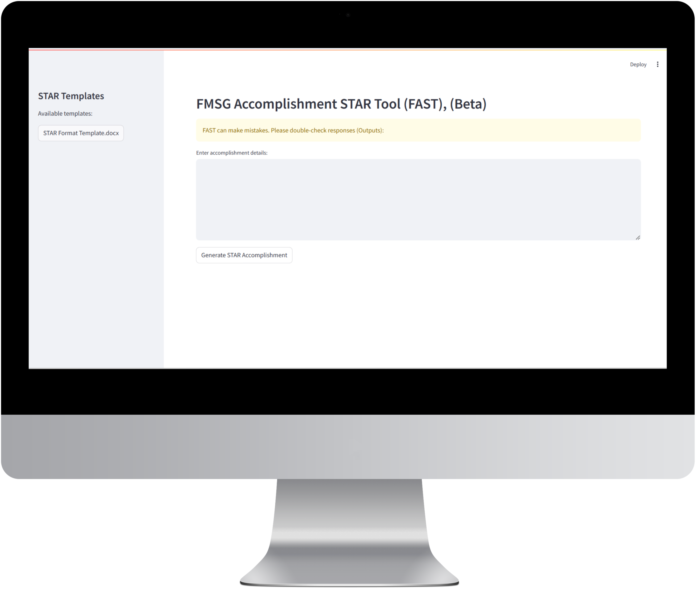

IMPORTANT NOTICE: This repository contains only mockups, documentation, and demonstration assets for the FAST application. The actual source code is not publicly available. This repository is intended for showcase and demonstration purposes only.
# FAST - FMSG Accomplishment STAR Tool

  

  <h3>Transform accomplishment details into professional STAR format narratives</h3>

## 📋 Overview
FAST (FMSG Accomplishment STAR Tool) is a Streamlit-based application that automates the conversion of raw accomplishment details into structured STAR format narratives (Situation, Task, Action, Result). Designed to streamline the documentation process for performance reviews, promotions, and recognition programs.

  

## ✨ Key Features
- **Automated STAR Generation**: Convert plain text into well-structured STAR format narratives
- **Parallel Processing**: Generate all STAR components simultaneously with asynchronous architecture
- **Professional Output**: Ensures third-person, professionally formatted narratives
- **Excel Export**: One-click export with optimized formatting for easy sharing
- **Template Integration**: Access to pre-formatted templates for various accomplishment types
- **Performance Optimized**: Rapid processing with resource caching and optimized initialization

## 🚀 Impact
- Reduces accomplishment writing time by 75% (from 2 hours to 30 minutes per document)
- Improves document quality by 85% through consistent STAR methodology adherence
- Saves an estimated 3,000+ hours of collective writing time annually
- Improves organizational efficiency by 40% through standardized documentation

## 📊 How It Works 
1. Input Accomplishment Details

2. Generate STAR Components

3. Export and Share

## 📚 Documentation
- [Feature Details](Docs/features.md)
- [FAQ](Docs/faq.md)

## 🛠️ Technology Stack
- **Frontend**: Streamlit
- **NLP Processing**: Custom-engineered prompting techniques
- **Data Processing**: Asynchronous Python architecture
- **Export Functionality**: Pandas, OpenPyXL

## 📄 License
© [2025] Eric A. All Rights Reserved.
